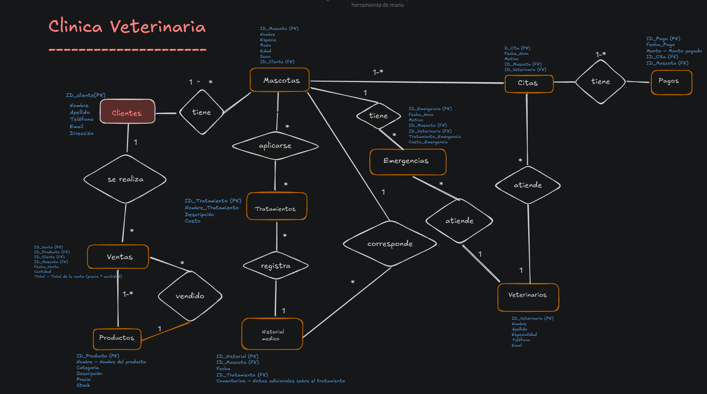
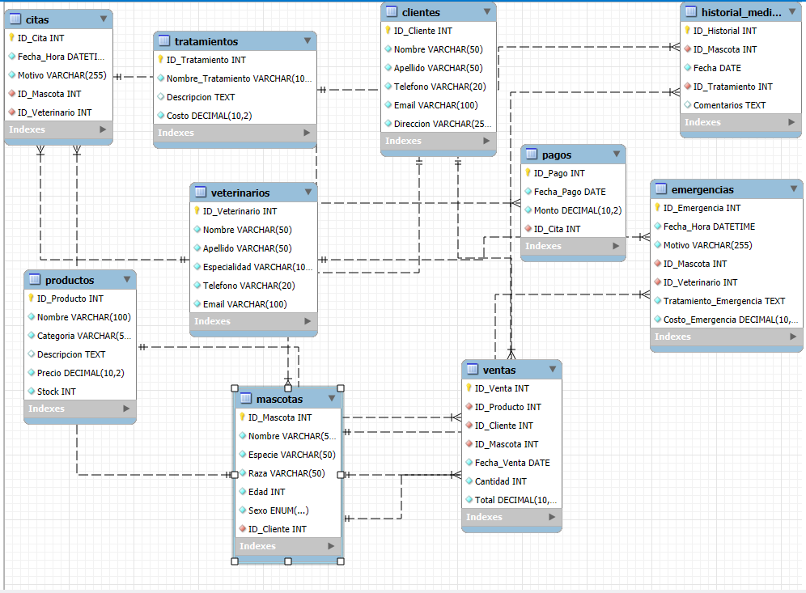

## PRIMER DER CLINICA VETERINARIA

## DER WORKBENCH

----
# Base de Datos: Veterinaria

La base de datos `veterinaria` está diseñada para gestionar las operaciones de una clínica veterinaria. Incluye información sobre clientes, mascotas, veterinarios, citas, tratamientos, productos, ventas, pagos, emergencias y el historial médico de las mascotas.

---

## Tablas Principales

### 1. Clientes
Registra la información de los clientes de la clínica.

- **Campos**:
  - `ID_Cliente` (INT, PK, AUTO_INCREMENT): Identificador único.
  - `Nombre` (VARCHAR(50)): Nombre del cliente.
  - `Apellido` (VARCHAR(50)): Apellido del cliente.
  - `Telefono` (VARCHAR(20)): Teléfono de contacto.
  - `Email` (VARCHAR(100)): Correo electrónico.
  - `Direccion` (VARCHAR(255)): Dirección del cliente.

### 2. Veterinarios
Almacena información de los veterinarios de la clínica.

- **Campos**:
  - `ID_Veterinario` (INT, PK, AUTO_INCREMENT): Identificador único.
  - `Nombre` (VARCHAR(50)): Nombre del veterinario.
  - `Apellido` (VARCHAR(50)): Apellido del veterinario.
  - `Especialidad` (VARCHAR(100)): Especialidad médica.
  - `Telefono` (VARCHAR(20)): Teléfono de contacto.
  - `Email` (VARCHAR(100)): Correo electrónico.

### 3. Tratamientos
Detalla los tratamientos ofrecidos en la clínica.

- **Campos**:
  - `ID_Tratamiento` (INT, PK, AUTO_INCREMENT): Identificador único.
  - `Nombre_Tratamiento` (VARCHAR(100)): Nombre del tratamiento.
  - `Descripcion` (TEXT): Detalles opcionales del tratamiento.
  - `Costo` (DECIMAL(10,2)): Costo del tratamiento.

### 4. Productos
Registra los productos disponibles para la venta.

- **Campos**:
  - `ID_Producto` (INT, PK, AUTO_INCREMENT): Identificador único.
  - `Nombre` (VARCHAR(100)): Nombre del producto.
  - `Categoria` (VARCHAR(50)): Categoría del producto.
  - `Descripcion` (TEXT): Detalles opcionales.
  - `Precio` (DECIMAL(10,2)): Precio por unidad.
  - `Stock` (INT): Cantidad disponible.

---

## Tablas Relacionales

### 5. Mascotas
Representa a las mascotas atendidas en la clínica, vinculadas a sus dueños.

- **Campos**:
  - `ID_Mascota` (INT, PK, AUTO_INCREMENT): Identificador único.
  - `Nombre` (VARCHAR(50)): Nombre de la mascota.
  - `Especie` (VARCHAR(50)): Especie (perro, gato, etc.).
  - `Raza` (VARCHAR(50)): Raza de la mascota.
  - `Edad` (INT): Edad en años.
  - `Sexo` (ENUM): Género de la mascota.
  - `ID_Cliente` (INT, FK): Relación con `Clientes`.

### 6. Citas
Registra las consultas agendadas.

- **Campos**:
  - `ID_Cita` (INT, PK, AUTO_INCREMENT): Identificador único.
  - `Fecha_Hora` (DATETIME): Fecha y hora de la cita.
  - `Motivo` (VARCHAR(255)): Razón de la consulta.
  - `ID_Mascota` (INT, FK): Relación con `Mascotas`.
  - `ID_Veterinario` (INT, FK): Relación con `Veterinarios`.

### 7. Historial Médico
Registra el historial clínico de las mascotas.

- **Campos**:
  - `ID_Historial` (INT, PK, AUTO_INCREMENT): Identificador único.
  - `ID_Mascota` (INT, FK): Relación con `Mascotas`.
  - `Fecha` (DATE): Fecha del registro.
  - `ID_Tratamiento` (INT, FK): Relación con `Tratamientos`.
  - `Comentarios` (TEXT): Notas adicionales.

### 8. Pagos
Registra los pagos realizados por los clientes.

- **Campos**:
  - `ID_Pago` (INT, PK, AUTO_INCREMENT): Identificador único.
  - `Fecha_Pago` (DATE): Fecha del pago.
  - `Monto` (DECIMAL(10,2)): Importe pagado.
  - `ID_Cita` (INT, FK): Relación con `Citas`.

### 9. Ventas
Registra las ventas de productos.

- **Campos**:
  - `ID_Venta` (INT, PK, AUTO_INCREMENT): Identificador único.
  - `ID_Producto` (INT, FK): Relación con `Productos`.
  - `ID_Cliente` (INT, FK): Relación con `Clientes`.
  - `ID_Mascota` (INT, FK): Relación con `Mascotas`.
  - `Fecha_Venta` (DATE): Fecha de la venta.
  - `Cantidad` (INT): Cantidad vendida.
  - `Total` (DECIMAL(10,2)): Importe total.

### 10. Emergencias
Registra las atenciones de urgencia.

- **Campos**:
  - `ID_Emergencia` (INT, PK, AUTO_INCREMENT): Identificador único.
  - `Fecha_Hora` (DATETIME): Fecha y hora de la emergencia.
  - `Motivo` (VARCHAR(255)): Razón de la atención.
  - `ID_Mascota` (INT, FK): Relación con `Mascotas`.
  - `ID_Veterinario` (INT, FK): Relación con `Veterinarios`.
  - `Tratamiento_Emergencia` (TEXT): Detalles del tratamiento.
  - `Costo_Emergencia` (DECIMAL(10,2)): Costo asociado.

---

## Relaciones

- **Clientes ↔ Mascotas**: Un cliente puede tener varias mascotas.
- **Mascotas ↔ Citas**: Una mascota puede tener múltiples citas.
- **Citas ↔ Veterinarios**: Cada cita es atendida por un único veterinario.
- **Mascotas ↔ Historial Médico ↔ Tratamientos**: Cada mascota tiene un historial médico que incluye tratamientos.
- **Citas ↔ Pagos**: Cada cita genera un único pago.
- **Clientes/Mascotas ↔ Ventas ↔ Productos**: Las ventas relacionan clientes y mascotas con productos.
- **Emergencias ↔ Mascotas/Veterinarios**: Cada emergencia involucra una mascota y un veterinario.

---

## Problemática que Resuelve

1. **Gestión Centralizada**: Organización de clientes, mascotas, citas y tratamientos.
2. **Historial Clínico Completo**: Seguimiento médico detallado de cada mascota.
3. **Control de Inventario**: Gestión eficiente de productos disponibles.
4. **Gestión de Pagos**: Registro claro de los ingresos generados.
5. **Atención de Emergencias**: Manejo ágil de casos urgentes.
6. **Análisis de Datos**: Generación de reportes sobre servicios y ventas.

---